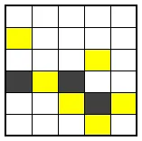

# 5049번
## 제목: 광석수집 2
## 문제
오늘은 권수쌤이 크기 $N \times M$ 인 광산에서 광물을 캐는 부업을 하는 날이다.   
광산은 세 가지 종류의 칸으로 구성되어 있다:
- 평범한 돌로 이루어진 칸 (이동 가능)
- 단단한 바위로 이루어진 칸 (이동 불가능)
- 황금이 묻힌 칸 (이동 가능하며, 지나가면 황금을 1개 얻는다)



최근 운동을 쉬어 근력이 약해진 권수쌤은 단단한 바위로 이루어진 칸을 통과할 수 없다.  
또한 체력도 예전 같지 않아서 항상 오른쪽 또는 아래쪽 방향으로만 이동하기로 했다.

광산의 가장 왼쪽 위 칸 (1, 1)에서 시작하여, 가장 오른쪽 아래 칸 (N, M)에 도착할 때까지 얻을 수 있는 황금의 최대 개수를 구하시오.

단, 출발지 (1,1) 혹은 도착지 (N,M)가 단단한 바위로 막혀 있거나, 어떠한 경로로도 도착할 수 없는 경우는 황금을 얻을 수 없으므로 정답은 0이 된다.

## 입력
첫 번째 줄에 광산의 세로 길이 $N$과 가로 길이 $M$이 공백으로 구분되어 주어진다. ($ 1 \leq N \leq 500,\ 1 \leq M \leq 500 $)  
두 번째 줄부터 $N$개의 줄에 걸쳐 각 줄마다 $M$개의 정수가 공백으로 구분되어 주어진다.  
각 정수는 해당 칸의 상태를 나타내며 다음과 같다:
- 0: 평범한 돌 (이동 가능, 황금 없음)
- 1: 단단한 바위 (이동 불가능)
- 2: 황금이 있는 칸 (이동 가능, 지나가면 황금 1개 획득)

## 출력
권수쌤이 캘 수 있는 황금의 최대 개수를 출력하라.​

## 입출력 예제
### 입력 1
```
6 5
0 0 0 0 0
2 0 0 0 0
0 0 0 2 0
1 2 1 0 0
0 0 2 1 2
0 0 0 2 0
```
### 출력 1
4


## 제한사항
- 시간제한: 1초
- 메모리 제한: 128MB
- 난이도: 실버 I
- 사용 언어: C++