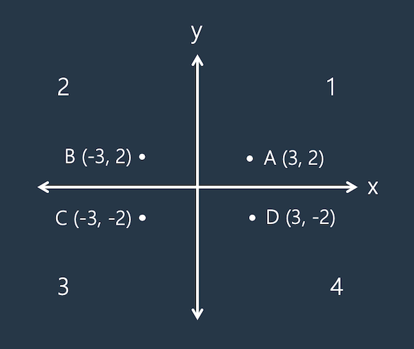

# 프로그래머스 입문 Day10-1
## 제목: 점의 위치 구하기
## 문제 설명
사분면은 한 평면을 x축과 y축을 기준으로 나눈 네 부분입니다. 사분면은 아래와 같이 1부터 4까지 번호를매깁니다.


- x 좌표와 y 좌표가 모두 양수이면 제1사분면에 속합니다.
- x 좌표가 음수, y 좌표가 양수이면 제2사분면에 속합니다.
- x 좌표와 y 좌표가 모두 음수이면 제3사분면에 속합니다.
- x 좌표가 양수, y 좌표가 음수이면 제4사분면에 속합니다.
x 좌표 (x, y)를 차례대로 담은 정수 배열 `dot`이 매개변수로 주어집니다. 좌표 `dot`이 사분면 중 어디에 속하는지 1, 2, 3, 4 중 하나를 return 하도록 solution 함수를 완성해주세요.

## 입출력 예시
### 예시 1
#### 입력
```
[2, 4]
```

#### 출력
```
1
```

### 예시 2
#### 입력
```
[-7, 9]
```

#### 출력
```
2
```


- `dot`의 길이 = 2
- `dot[0]`은 x좌표를, `dot[1]`은 y좌표를 나타냅니다
- -500 ≤ `dot`의 원소 ≤ 500
- `dot`의 원소는 0이 아닙니다.
- 사용 언어: C++

#### 결과
```
테스트 1 〉	통과 (0.01ms, 3.97MB)
테스트 2 〉	통과 (0.01ms, 4.02MB)
테스트 3 〉	통과 (0.01ms, 3.93MB)
테스트 4 〉	통과 (0.01ms, 3.92MB)
테스트 5 〉	통과 (0.01ms, 4.02MB)
테스트 6 〉	통과 (0.01ms, 3.9MB)
테스트 7 〉	통과 (0.01ms, 3.81MB)
테스트 8 〉	통과 (0.01ms, 4.02MB)
테스트 9 〉	통과 (0.01ms, 4.02MB)
테스트 10 〉	통과 (0.01ms, 3.88MB)
테스트 11 〉	통과 (0.01ms, 4MB)
테스트 12 〉	통과 (0.01ms, 4.02MB)
테스트 13 〉	통과 (0.01ms, 3.97MB)
테스트 14 〉	통과 (0.01ms, 3.82MB)
테스트 15 〉	통과 (0.01ms, 3.82MB)
테스트 16 〉	통과 (0.01ms, 4.02MB)
```